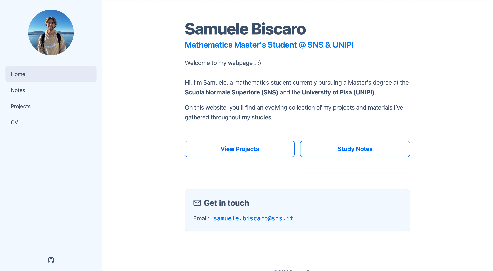

# Personal Website



Personal website hosted on **GitHub Pages**, built using **Astro** and **TailwindCSS**.

## Technical Stack

- **Framework:** [Astro](https://astro.build) (Static Site Generation)
- **Styling:** [Tailwind CSS](https://tailwindcss.com/) & [DaisyUI](https://daisyui.com/)
- **Package Manager:** [pnpm v10](https://pnpm.io/)

## Local Development

Ensure you have **pnpm** installed. To start your development environment:

```bash
# Install dependencies (respecting pnpm v10 hoisting)
pnpm install

# Start the local server at http://localhost:4321
pnpm run dev
```
